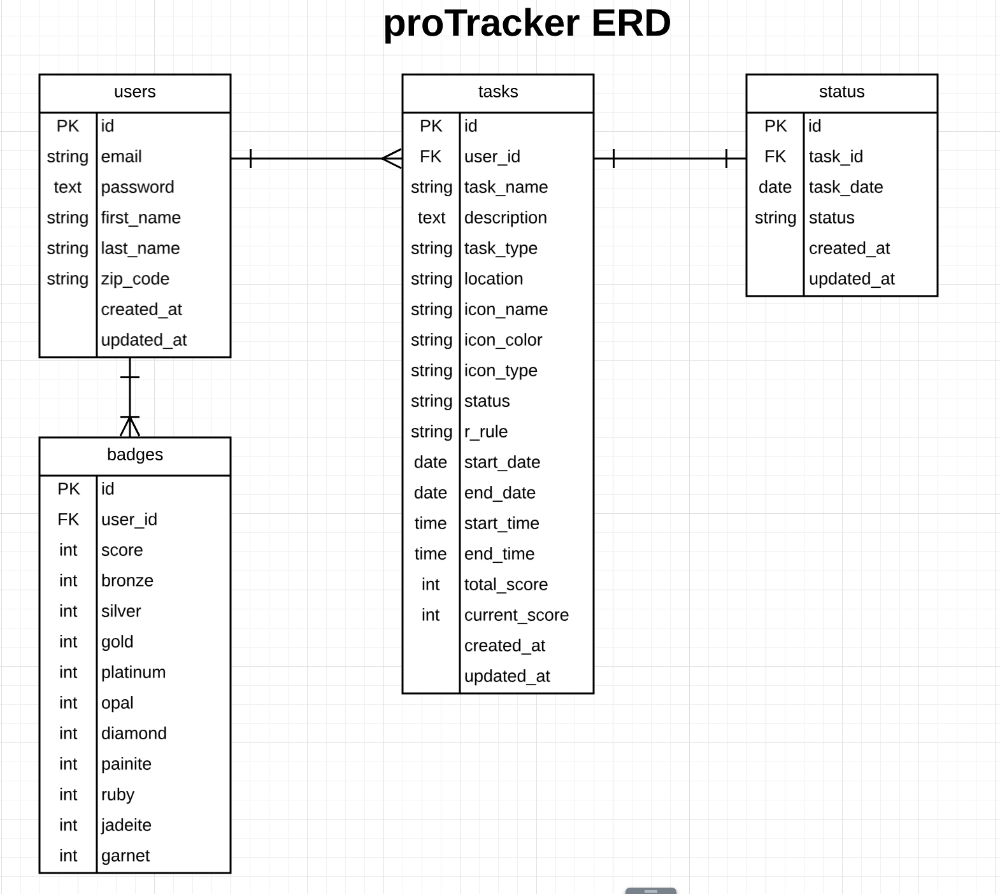

# proTracker Backend

## About the project

proTracker is a one stop app where you can plan your day, create habits and track them. It helps the user to stay organized by being able to view everyday's task for the current week. proTracker gives an overview about how you have been consistent with your habits or tasks with longest streaks.

## Features

- Create, delete a user
- Users can create, edit, delete a task
- Create, edit and delete status for a task
- Create, update and delete badges

## What does frontend of proTracker looks like?

### BUILT WITH

    - PostgreSQL
    - Nodejs
    - Knex
    - Express
    - Moment
    - RRule

### Frontend for this app can be viewed in
-  https://github.com/SuryaKrishnaMoorthy/Pro_Tracker

## How to install?

1. Fork and/or Clone this repository

1. `npm install`

1. `mv .env.sample .env`

1. `createdb pro_tracker_dev && createdb pro_tracker_test`

### Developed By

  - For more information, please contact: Surya Krishna Moorthy at: ayrus2289@gmail.com
